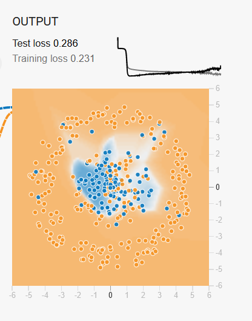
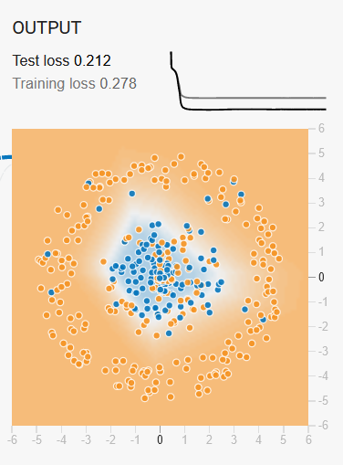
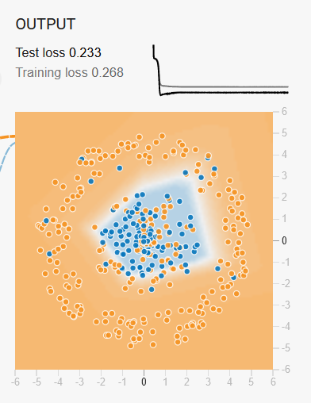

# Activations, regularizations and loss

For this report, I limited my exploration to the topics covered the lecture, namely activations, regularizations, and loss functions. With that in mind, I took another look at the tensorflow playground.

## Activations

First I took a look at the activations. The playground had 4 available - RelU, tanh, sigmoid and linear.

### Linear

My first assumption was that linear would perform the worst. This might be because combining a linear function with another linear function simply results in a different linear function and no non-linearity is introduced into the model. Without non-linearity the model would not be able to learn complex patterns in the data beyond a single linear line. I proceeded to test this for a classification use case without any regularization and a 80-20 split between training and validation data. To be consistent I also used a 4 layer neural net for all these experiments. I tested with all four provided datasets.

The results were only good for data that was split evenly in a linear manner.

For any other dataset, the test loss was 0.5 or above and the model was not really learning anything about the data.

### RelU

I switched out the activation function to RelU and noticed some immediate improvements. There was now some non-linearity introduced in the model's output. Testing with the other parameters the same, this is the result with the first dataset.

I found the sharp edges in the classification output very fascinating. It made sense when visualizing the graph for RelU.

Since the RelU function is basically a hard cut-off for anything below zero, it makes sense that the edges where non-linearity is introduced would also be very sharp. However sudden sharp edges such as this are not as suitable if the data is even more complicated. As discussed in intuition report 2, we would need more layers if we wanted to keep using RelU with more complex data.

### Tanh

Since tanh unlike RelU doesn't have a harsh cutoff, but instead a smooth curve I expect the edges in the classification result to be a bit smoother. Whether tanh will be better than RelU though remains to be seen.

Indeed, the hypothesis is correct as tanh results a similar result as RelU but with curved edges. This is also true for other types of data.

Of course with very complex data, even tanh was unable to get any better results than RelU. This shows perhaps an inherent limitation in using only 4 layers in a neural net for complex problems.

### Sigmoid

Since the sigmoid curve is very similar to tanh, I expected the results to be similar to tanh. However, upon testing the model using sigmoid as an activation to not learn a lot. The only case where the model learned anything was the simplest use case that could also have been approximated by a linear function.

After this I felt a little disappointed as I couldn't really understand why this was happening. After doing some research I learned about the vanishing gradients problem with sigmoids when approaching 0 or 1, although I was still unsure if this was the cause behind the poor performance. However I did learn that sigmoid is much better when used in regression problems. So I gave that a try by switch the problem type in the tensorflow playground to a regression problem.

Indeed it did work quite well!

## Regularization

Before this experiment, my understanding of regularization was that it was a technique to limit how much the gradients can change in one training cycle. I believed this was useful in preventing overfitting and also for preventing gradients becoming close to zero or very large.

With this knowledge in hand, I figured the best approach was to simulate some overfitting and then experiment using different forms of regularization. To cause overfitting, I turned the noise slider to maximum to ensure there were irregularities in the data. Then I proceedeed to add a lot of layers to the neural net and added more parameters to the input so there was more capacity to overfit. Then I trained until the loss started to increase, which took close to 1000 epochs. The result was as follows.

Next I set the regularization to L1 norm. At first I set regularization to 0 and found that this did nothing to change the results. I understood then that the regularization rate controlled the extent of regularization. After experimenting with a few values, I realized that a regularization rate that was too high impeded training as the gradients would barely change. 0.03 seemed to be a sweet spot. The result after also training for 1000 epochs now barely had any overfitting.

I tried the same thing with L2 norm regularization with the same regularization rate of 0.03. The results were similar with overfitting greatly reduced. There are slight differences but I am not sure why yet. I definitely have to look more into the differences between the two later.

